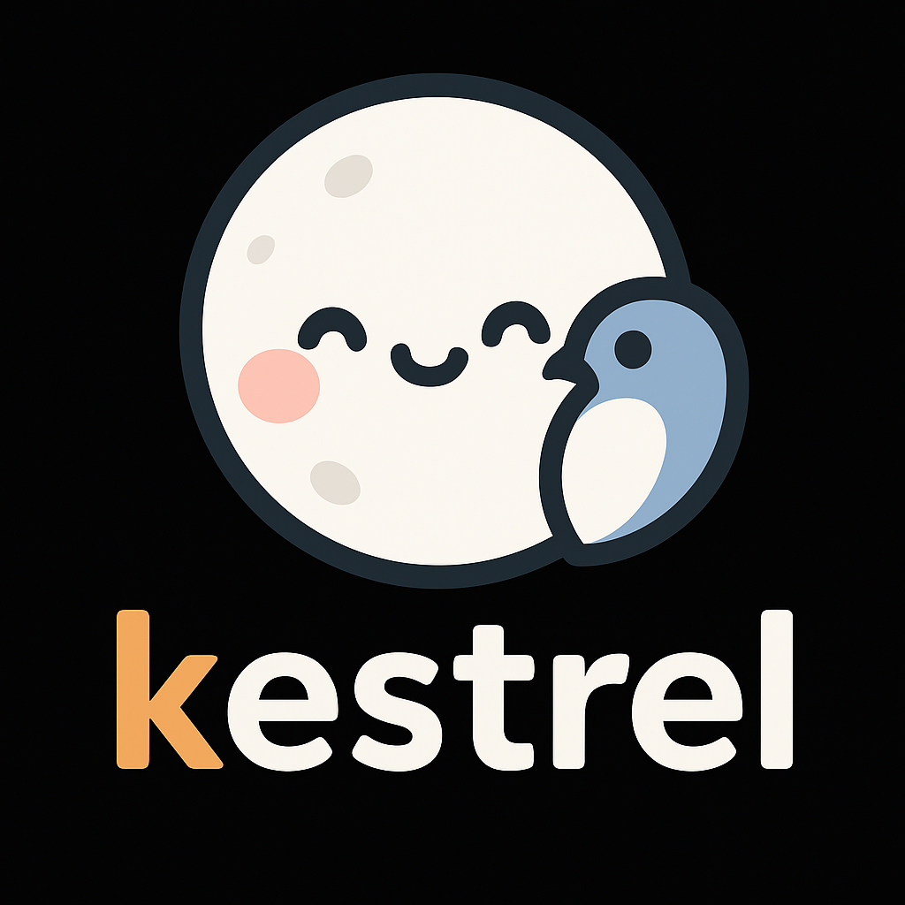

# Kestrel Inference Engine

<p align="center">
  
</p>

Kestrel wraps the Moondream vision-language model in an async, micro-batched serving stack. Every request flows through a skill-driven pipeline that normalises inputs, schedules compute, and streams results back to clients without compromising throughput.

- **Request lifecycle** – Front-ends (CLI, HTTP) hand prompts to the shared inference engine, which resolves the active skill, prepares prompt and image tensors, and tracks latency metrics while streaming updates back to clients.
- **Skills layer** – Query, caption, point, and detect skills ship by default. Each skill owns its prompt template, decode phases, and result shaping, and new modalities integrate by registering additional skills without modifying scheduler internals.
- **Generation scheduler** – A cooperative scheduler batches work across requests, drains async queues, and applies temperature/top-p sampling so heterogeneous skills can share one decode loop while preserving per-request state machines.
- **Runtime & attention core** – The Moondream runtime manages tensor allocation, paged prefill and decode, FlashInfer-backed attention, and image-token fusion, exposing entry points the scheduler drives during prefill and incremental decoding.
- **Paged KV cache** – A vLLM-style paged cache lets sequences claim and release fixed-size pages so large numbers of long-context requests remain resident while keeping attention updates proportional to the active tokens.
- **Vision preprocessing** – Optional image tiling and cropping run in a background thread pool before scheduling, and the resulting embeddings are stitched into the text prompt so multimodal and text-only requests follow the same execution path.
- **Streaming & observability** – Streaming iterators surface incremental text chunks in real time, and finished results report token counts plus prefill, decode, and first-token latencies that the HTTP server forwards to clients.
- **Serving surfaces & ops** – The CLI and Starlette HTTP server share the same engine wiring, ensuring smoke tests, benchmarks, and production traffic all exercise identical scheduling logic while respecting the central runtime configuration.

## API Overview

### Python Engine

```python
from pathlib import Path

import torch

from kestrel.config import ModelPaths, RuntimeConfig
from kestrel.engine import InferenceEngine
import pyvips

cfg = RuntimeConfig(
    model_paths=ModelPaths(
        weights=Path("~/code/moondream/model.pt").expanduser(),
    ),
    device="cuda",
    dtype=torch.bfloat16,
    max_batch_size=4,  # effective; batch_idx 0 is reserved internally
)
engine = await InferenceEngine.create(cfg)

image = pyvips.Image.new_from_file("demo.jpg")
result = await engine.query(
    image=image,
    question="Describe the image.",
    settings={
        "temperature": 0.2,
        "top_p": 0.9,
        "max_tokens": 768,
    },
)
print(result.output["answer"])

point_result = await engine.point(
    image,
    "cat",
    settings={"max_objects": 2},
)
print(point_result.output["points"])

detect_result = await engine.detect(
    image,
    "cat",
    settings={"max_objects": 4},
)
print(detect_result.output["objects"])

caption_result = await engine.caption(
    image,
    length="normal",
    settings={
        "temperature": 0.2,
        "top_p": 0.9,
        "max_tokens": 768,
    },
)
print(caption_result.output["caption"])
```

- `InferenceEngine.query(...)`, `.caption(...)`, `.point(...)`, and `.detect(...)` mirror the `moondream` reference API (async, with optional `settings` dictionaries). When `stream=True` is passed to `query` or `caption`, the helpers now return an `EngineStream` async iterator that yields incremental text chunks while decoding continues. Reasoning traces remain opt-in via the `reasoning` flag.
- Direct helpers like `engine.query(...)`, `engine.point(...)`, `engine.detect(...)`, and `engine.caption(...)` remain the supported public surface.
- Default sampling settings mirror `external/moondream`: temperature `0.2`, top-p `0.9`, and a `max_tokens` budget of `768`. Structured skills continue to expose `max_objects=150` unless callers override it.

#### Streaming usage

```python
query_stream = await engine.query(
    question="Summarize the scene.",
    reasoning=False,
    stream=True,
    settings={"max_tokens": 768},
)
async for update in query_stream:
    print(f"answer += {update.text}")
query_result = await query_stream.result()
print("final", query_result.output["answer"])

caption_stream = await engine.caption(
    image=image,
    length="short",
    stream=True,
    settings={"temperature": 0.2, "max_tokens": 80},
)
chunks = []
async for update in caption_stream:
    chunks.append(update.text)
caption_result = await caption_stream.result()
assert "".join(chunks) == caption_result.output["caption"]
```

#### LoRA adapters (experimental)

LoRA adapters can be attached to the text model's MLP layers (both dense and MoE) for parameter-efficient fine-tuning experiments.

```python
from kestrel.moondream.lora import LoRA, TextLoRAConfig
from kestrel.moondream.config import load_config

# Load model config (or use defaults with load_config(None))
config = load_config(None)

# Create LoRA adapter
lora = LoRA.create(
    text_config=config.text,
    lora_config=TextLoRAConfig(rank=8, alpha=16.0),
    dtype=torch.bfloat16,
).to("cuda")

# Pass to engine at creation time
engine = await InferenceEngine.create(cfg, lora=lora)
```

**Limitations:**
- LoRA must be created before engine initialization (required for CUDA graph capture).
- A single LoRA is shared across all requests; per-request adapters are not yet supported.
- Only text MLP layers are covered; attention LoRA is not implemented.

### Skills

- `kestrel.skills.base.SkillSpec` defines the contract for prompt construction, structured phase recipes, and result formatting.
- `kestrel.skills.query.QuerySkill` is registered by default. Additional skills can be registered via `SkillRegistry([...])` and passed to `InferenceEngine.create(..., skills=registry)`.

### CLI

- `uv run python -m kestrel.main serve` – launch the HTTP server (see usage examples below for full command).
- `uv run python -m kestrel.main schedule ...` – push one-off prompts through the async engine for smoke testing or benchmarking.

### Evaluation Scripts

- `scripts/chartqa_eval.py` – Internal helper for running ChartQA accuracy checks against a local or remote GPU install.

  ```bash
  # Install optional evaluation dependencies (datasets, tqdm) into your uv environment
  UV_PRERELEASE=allow uv sync --extra eval

  # Run a short sanity sweep over 20 examples (requires a CUDA-capable host)
  UV_PRERELEASE=allow uv run --extra eval \
    python scripts/chartqa_eval.py \
    --weights ~/code/moondream/model.pt \
    --limit 20

  # Omit --limit (or pass --limit -1) once you're ready to process the full ChartQA split
  ```

  The script expects access to the ChartQA dataset (`datasets` library) and the Moondream weights. When running on a remote GPU host, sync the repository (for example with `./sync.sh p1`) before invoking the command there.

### Running Unit Tests

```bash
# Install dev dependencies
uv sync --extra dev

# Run all tests
uv run python -m pytest tests/ -v

# Run a specific test file
uv run python -m pytest tests/moondream/test_lora_workspace.py -v
```

### Profiling the Fused MoE Kernel

The `scripts/profile_scattermoe.py` helper (name retained for compatibility) drives the Moondream fused MoE MLP with realistic shapes (prefill: batch 1 × ~832 tokens, decode: batch 4 × 1 token) and adds NVTX ranges so Nsight Compute can latch onto the Triton kernels.

1. Sync the repository to the target GPU host (e.g. `./sync.sh p1`) and ensure `uv` is on the PATH.
2. Collect a prefill profile with richer counters:

   ```bash
   sudo bash -lc '
     cd /home/ubuntu/code/kestrel &&
     /opt/nvidia/nsight-compute/2024.1.1/ncu \
       --set default \
       --section LaunchStats \
       --section SpeedOfLight \
       --section Occupancy \
       --section SchedulerStats \
       --section WarpStateStats \
       --section SourceCounters \
       --section MemoryWorkloadAnalysis \
       --target-processes all \
       --force-overwrite \
       --metrics gpu__time_duration.sum,sm__warps_active.avg.pct_of_peak_sustained_active,sm__pipe_tensor_active.avg.pct_of_peak_sustained_active,smsp__sass_thread_inst_executed_op_ffma_pred_off.sum,smsp__warp_issue_stalled_selected.sum,smsp__warp_issue_stalled_barrier.sum,lts__t_sectors_srcunit_tex_op_read.sum,dram__bytes.sum \
       --export /tmp/profile_scattermoe_prefill \
       /home/ubuntu/.local/bin/uv run python scripts/profile_scattermoe.py \
         --mode prefill \
         --iterations 5 \
         --warmup-iters 3 \
         --nvtx
   '
   ```

3. Collect the decode profile with deeper pipeline sections and expanded stall metrics:

   ```bash
   sudo bash -lc '
     cd /home/ubuntu/code/kestrel &&
     /opt/nvidia/nsight-compute/2024.1.1/ncu \
        --set default \
        --section LaunchStats \
        --section SpeedOfLight \
        --section Occupancy \
        --section SchedulerStats \
        --section WarpStateStats \
        --section SourceCounters \
        --section MemoryWorkloadAnalysis \
        --target-processes all \
        --force-overwrite \
        --metrics \
gpu__time_duration.sum,sm__warps_active.avg.pct_of_peak_sustained_active,sm__pipe_tensor_active.avg.pct_of_peak_sustained_active,smsp__sass_thread_inst_executed_op_ffma_pred_off.sum,smsp__warp_issue_stalled_selected.sum,smsp__warp_issue_stalled_barrier.sum,lts__t_sectors_srcunit_tex_op_read.sum,dram__bytes.sum,sm__throughput.avg.pct_of_peak_sustained_elapsed,smsp__warp_issue_stalled_long_scoreboard.sum,smsp__warp_issue_stalled_short_scoreboard.sum,smsp__warps_eligible_per_scheduler.avg,sm__pipe_fma_active.avg.pct_of_peak_sustained_active,l1tex__t_sectors_pipe_lsu_mem_global_op_ld.sum,l1tex__t_sectors_pipe_lsu_mem_global_op_st.sum,lts__throughput.avg.pct_of_peak_sustained_elapsed,dram__throughput.avg.pct_of_peak_sustained_elapsed \
        --export /tmp/profile_scattermoe_decode \
        /home/ubuntu/.local/bin/uv run python scripts/profile_scattermoe.py \
        --mode decode \
        --iterations 10 \
        --warmup-iters 5 \
        --refresh-routing \
        --nvtx
   '
   ```

The resulting `.ncu-rep` files can be opened locally via `ncu --import /tmp/profile_scattermoe_prefill.ncu-rep --page raw --csv` (or in the Nsight Compute GUI). Running under `sudo` sidesteps the performance-counter permission requirement; alternatively configure `NVreg_RestrictProfilingToAdminUsers=0` on the host.

For a one-off launch-overhead snapshot, reuse the same command with `--metrics gpu__time_duration.sum` so you can divide the reported duration by the kernel count.

### HTTP Endpoints

`POST /v1/query`

```json
{
  "question": "Describe the image",
  "image_url": "data:image/png;base64,<...>",
  "settings": {
    "temperature": 0.2,
    "top_p": 0.9,
    "max_tokens": 768
  }
}
```

Response fields include the generated `answer`, a `finish_reason` aligned with OpenAI semantics (`stop` or `length` today), and timing metrics (`input_tokens`, `output_tokens`, `prefill_time_ms`, `decode_time_ms`, `ttft_ms`). When `"stream": true` is supplied, the endpoint upgrades to Server-Sent Events and emits incremental `chunk` payloads; the final event carries the completed answer alongside metrics.

`POST /v1/point`

```json
{
  "object": "burger",
  "image_url": "data:image/png;base64,<...>",
  "settings": {
    "max_objects": 2
  }
}
```

Responses include `points` (normalised `[x, y]` pairs), `finish_reason`, request metadata, and the same timing metrics as `/v1/query`.

`POST /v1/detect`

```json
{
  "object": "burger",
  "image_url": "data:image/png;base64,<...>",
  "settings": {
    "max_objects": 10
  }
}
```

Returns `objects` (each `{ "x_min", "y_min", "x_max", "y_max" }`), the finish reason, and latency metrics matching `/v1/query`.

`POST /v1/caption`

```json
{
  "image_url": "data:image/png;base64,<...>",
  "length": "normal",
  "settings": {
    "temperature": 0.2,
    "top_p": 0.9,
    "max_tokens": 768
  }
}
```

Responses include the generated `caption`, finish reason, and the standard metrics block.

## Usage Examples

### Downloading Checkpoint

To test inference, you will need a Moondream checkpoint in vixtral weights format. You can obtain by running the following. You will first need to request access to [vikhyatk/moondream-next](https://huggingface.co/vikhyatk/moondream-next) and reach out to vik to get the access request approved (be sure to mention your Hugging Face username when making this request).

```
from huggingface_hub import hf_hub_download

pt_file = hf_hub_download(
    "vikhyatk/moondream-next",
    # moe-glu-3c-warp4_1/s1921
    revision="d7af1649689208e30e657a8ad52017346e137c39",
    filename="model.pt",
)
```

### Sampling & Benchmarking How-To

- **Sampling smoke test**

  ```bash
  uv run python -m kestrel.main schedule \
      "Tell me about the oceans." \
      "How do rockets work?" \
      --weights ~/code/moondream/model.pt \
      --max-batch-size 8 \
      --max-new-tokens 256 \
      --device cuda --dtype bfloat16 --stream
  ```

  Exercises the asynchronous engine end-to-end; expect full responses (no immediate EOS) on the first decode step.
  `--max-batch-size` is the effective batch size; batch_idx 0 is reserved internally.

### HTTP Server

- **Launch**

  ```bash
  uv run python -m kestrel.main serve \
      --weights ~/code/moondream/model.pt \
      --device cuda --dtype bfloat16 \
      --max-batch-size 64 \
      --default-max-new-tokens 512 \
      --host 0.0.0.0 --port 8080
  ```

  The server primes the shared engine on startup and then serves concurrent POST requests at `http://<host>:<port>/v1/query`. `/healthz` returns 200 once the warmup finishes.

- **Request shape**

  ```json
  {
    "question": "Describe the image",
    "image_url": "data:image/png;base64,<...>",
    "settings": {
      "temperature": 0.2,
      "top_p": 0.9
    }
  }
  ```

  `image_url` must be a base64 blob (raw or `data:image/...;base64,<payload>`). Responses include the generated `answer`, `request_id`, `finish_reason`, and engine timings (`input_tokens`, `output_tokens`, `prefill_time_ms`, `decode_time_ms`, `ttft_ms`).

- **Point detection example**

  ```bash
  curl -s http://127.0.0.1:8080/v1/point \
      -H 'content-type: application/json' \
      -d '{
            "object": "burger",
            "image_url": "data:image/jpeg;base64,'"$(base64 -w0 external/moondream/assets/demo-1.jpg)"'"
          }'
  ```

  Returns normalised coordinates under the `points` key.
